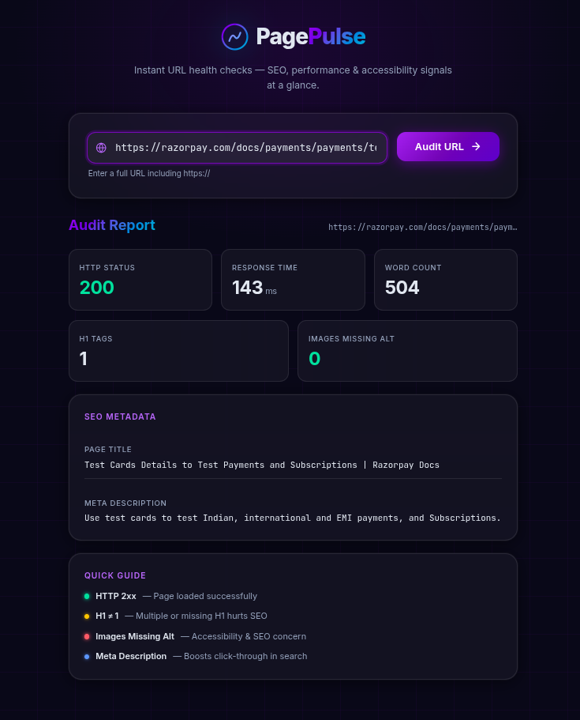

# Page Pulse 🔍

> A fast, zero-dependency-frontend URL auditing tool. Paste any URL, get an instant SEO health report.



---

## Table of Contents

1. [Setup & Running Locally](#setup--running-locally)
2. [API Contract](#api-contract)
3. [Design Decisions](#design-decisions)
4. [Project Structure](#project-structure)
5. [AI Usage](#ai-usage)

---

## Setup & Running Locally

### Prerequisites

- **Node.js v18+** (uses native `AbortController` and `URL`)
- **npm v8+**

### Steps

```bash
# 1. Clone the repo
git clone https://github.com/AmanSaleem24/page_pulse.git
cd page_pulse

# 2. Install dependencies
npm install

# 3. Start the development server (with auto-restart on file changes)
npm run dev

# 4. Open in browser
open http://localhost:5001
```

### Environment Variables

| Variable | Default | Description |
|----------|---------|-------------|
| `PORT`   | `5001`  | The port the server listens on |

Set a custom port:
```bash
PORT=8080 npm start
```

No `.env` file is needed for local development — `PORT` is the only variable this app reads.

### Available Scripts

| Script       | Command                              | Description                          |
|--------------|--------------------------------------|--------------------------------------|
| `npm start`  | `node src/server.js`                 | Production start                     |
| `npm run dev`| `node --watch src/server.js`         | Dev mode with auto-restart           |
| `npm test`   | `jest --runInBand --forceExit`       | Run all tests                        |

---

## API Contract

### `POST /api/audit`

Audits a URL and returns structured SEO and performance data.

#### Request

```
POST /api/audit
Content-Type: application/json
```

```json
{
  "url": "https://example.com"
}
```

| Field | Type   | Required | Description |
|-------|--------|----------|-------------|
| `url` | string | ✅       | A well-formed `http` or `https` URL to audit |

#### Success Response — `200 OK`

```json
{
  "httpStatus": 200,
  "responseTimeMs": 312,
  "pageTitle": "Example Domain",
  "metaDescription": "An example page for demonstration purposes.",
  "h1Count": 1,
  "imagesMissingAlt": 0,
  "wordCount": 247
}
```

| Field              | Type   | Description |
|--------------------|--------|-------------|
| `httpStatus`       | number | HTTP status code returned by the target URL |
| `responseTimeMs`   | number | Time in milliseconds to receive the full response |
| `pageTitle`        | string | Text content of `<title>` tag, empty string if absent |
| `metaDescription`  | string | `content` of `<meta name="description">`, empty string if absent |
| `h1Count`          | number | Number of `<h1>` elements on the page |
| `imagesMissingAlt` | number | Count of `` tags with no `alt` attribute or an empty `alt` |
| `wordCount`        | number | Approximate count of visible words (script/style/markup stripped) |

#### Error Responses

| Status | Trigger | Example `error` message |
|--------|---------|------------------------|
| `400 Bad Request` | Missing, empty, or malformed URL; non-http/https protocol | `"Only http and https URLs are supported. Received protocol: "ftp:"."` |
| `415 Unsupported Media Type` | Target URL returns non-HTML content-type (e.g. `application/json`, `image/png`) | `"The URL did not return an HTML page. Got content-type: \"application/json\"."` |
| `502 Bad Gateway` | DNS failure, connection refused, host unreachable | `"Could not reach \"example.com\". The host may be down..."` |
| `504 Gateway Timeout` | Target server did not respond within 10 seconds | `"Request timed out after 10 seconds."` |
| `500 Internal Server Error` | Unexpected server-side error | `"An unexpected error occurred while fetching the page."` |

All error responses follow this shape:
```json
{
  "error": "Human-readable description of what went wrong."
}
```

Stack traces are **never** included in error responses.

---

## Design Decisions

---

### Decision 1: Pure parsing functions isolated in `src/parser.js`

**What was decided:** All cheerio-based extraction logic (`extractTitle`, `countH1s`, etc.) lives in a single file of pure functions that accept a loaded cheerio instance and return plain values. The route handler calls these functions but does not contain parsing logic itself.

**Reasoning:** Separating DOM parsing into pure, deterministic functions cleanly decouples content extraction from Express request handling and network I/O. This makes unit testing trivial — we can test edge cases (missing tags, empty alt attributes, word count edge cases) in `parser.test.js` using local HTML fixtures without mocking Express requests or network sockets.

---

### Decision 2: Native `http`/`https` fetcher + custom status mapping for error classification

**What was decided:** The fetch layer uses Node's native `http`/`https` modules wrapped with an `AbortController` timeout. Errors are classified into specific HTTP status codes (400 for bad input, 415 for non-HTML MIME types, 502 for connection/DNS failures, 504 for timeouts).

**Reasoning:** Using Node's native HTTP/1.1 client ensures maximum compatibility across web servers without triggering HTTP/2 connection drops common with undici on certain targets. Differentiating error states (504 vs 502 vs 415) gives API consumers precise, actionable feedback on whether the problem was a timeout, a dead host, or an unsupported file type, rather than masking everything behind a generic 500.

---

### Decision 3: Single Express server serves both API and static frontend

**What was decided:** The Express server mounts the static `public/` directory at the root path and the `/api/audit` route on the same port. There is no separate frontend dev server or build step.

**Reasoning:** Serving the static SPA directly from Express keeps the architecture simple, fast, and lightweight. It eliminates CORS issues between frontend and backend and simplifies deployment to any host to a single command (`npm start`) without needing extra build pipelines or multi-service setups.

---

## Project Structure

```
page_pulse/
├── src/
│   ├── server.js      # Express app — serves static files + mounts API
│   ├── audit.js       # POST /api/audit route handler
│   ├── parser.js      # Pure cheerio parsing functions
│   └── validate.js    # URL validation helper
├── public/
│   ├── index.html     # Single-page frontend
│   ├── style.css      # Dark glassmorphism styles
│   └── app.js         # Frontend JS — fetch, render, state
├── tests/
│   ├── fixtures/
│   │   ├── full.html      # All SEO fields present
│   │   ├── empty.html     # No title / meta / h1 / imgs
│   │   └── partial.html   # Multiple h1s, missing alt on all imgs
│   ├── parser.test.js     # Unit tests for parser functions
│   └── audit.test.js      # Integration / failure-case tests
├── .gitignore
├── package.json
└── README.md
```

---

## AI Usage

AI tooling (Antigravity pair programmer) was utilized during the development of Page Pulse to accelerate initial project scaffolding, assist in designing the dark glassmorphism UI system, and write comprehensive Jest test suites (unit tests for Cheerio parsers and integration tests for Express error handling). AI assistance was also leveraged to debug low-level networking edge cases — specifically diagnosing HTTP/2 socket drops with `undici` and transitioning the fetch layer to Node's native `http`/`https` modules for HTTP/1.1 compatibility. All core architectural decisions, code verification, manual testing, and design choices were reviewed, validated, and finalized by the developer.
